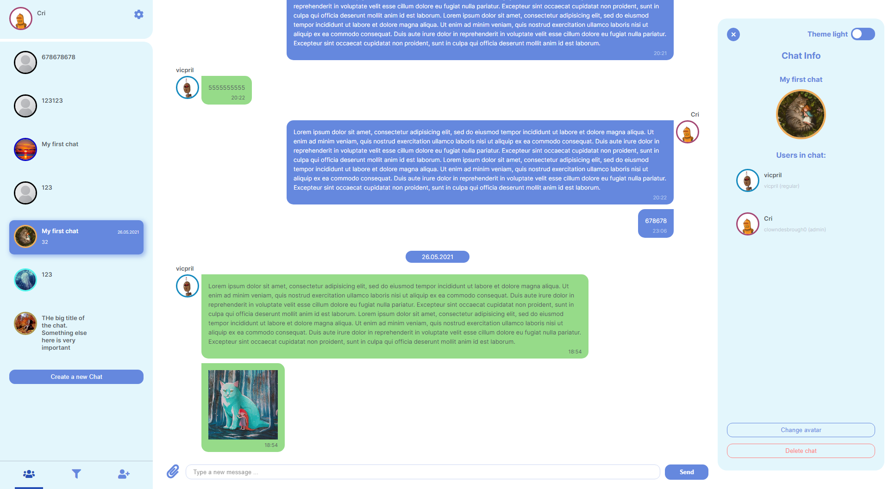
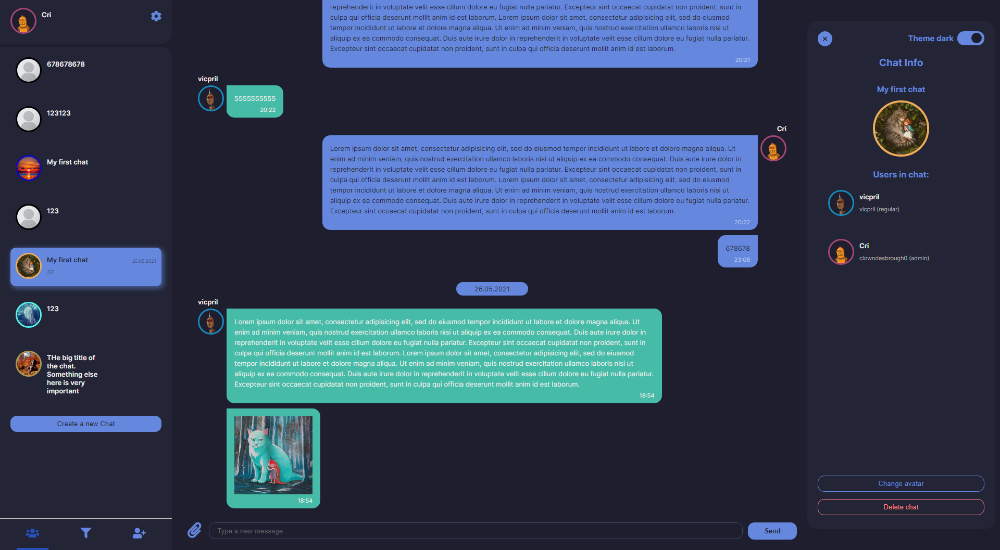

# Easy conversation

 

## Описание

Добро пожаловать в чат «**Непринужденное общение**». Здесь вы найдете собеседника для любой темы… Или Вас найдут ;)
По правде говоря, это учебное задание курса **Яндекс.Практикум «Мидл-фронтенд разработчик»**. Модуль 1. Спринт 4.

## Для ревьювера

https://github.com/vicpril/mf.messenger.praktikum.yandex/pull/6

**_Готово 4\* спринт:_**

-  Реализована отправка изображений в чат.
-  Реализовано переключение светлой/темной темы с приятной анимацией.

**_Готово 4 спринт:_**

-  Настроен **Webpack**:
   -  установлены лоадеры для js, ts, css, scss, файлов картинок и шрифтов.
   -  настроено динамическое определение среды разработки.
   -  подключены плагины: CleanWebpackPlugin, HTMLWebpackPlugin, TerserPlugin, CopyWebpackPlugin, MiniCssExtractPlugin, CssMinimizerPlugin.
   -  настроен devServer на 3000 порту.
-  Образ Docker-сборки в `./Dockerfile`. Быстрый запуск через `docker-compose up --build`.
-  Проект с Docker-сборкой размещен на [Heroku](https://es-chat-app.herokuapp.com/).
-  Настроен `precommit` с помощью `husky` и `lint-staged`
-  Выполнен `npm audit`, версии основных зависимостей зафиксированы. (Аудит показывает уязвимости для зависимостей `stylelint`. Уязвимости пока не решаются, т.к. эти зависимости только для разработки и в продакн не попадают, я оставил в таком виде)

**_Готово 3 спринт:_**

-  Реализован роутинг страниц: авторизации, регистрации, чатов, ошибок 404, 500.
   Редирект авторизованного пользователя на страницу чатов, неавторизованного на страницу регистрации.
   Работает история браузера, переходы назад/вперед.

-  Реализовано хранение состояния приложения по аналогии Redux. [Описание для истоии](https://yandex-students.slack.com/archives/C01ULNXB2HK/p1619947642074100?thread_ts=1619859734.055200&cid=C01ULNXB2HK)

-  Написаны контроллеры приложения. Папка `/client/src/controllers`
-  Написаны модули запросов к API авторизации, пользователей, чатов. Папка `/client/src/xhr`
-  Подключен WebSocket для обмена реал-тайм сообщениями, для подгрузки непрочитанных сообщений. Папка `/client/src/connections`
-  Включена автопроверка новых сообщений.
-  Внедрена проверка от XSS и DOS при отправке сообщений/данных пользователя.
-  Написаны тесты для шаблонизаторов, роутера, объектов компонентов, модуля отправки запросов.

**_Готово 2 спринт:_**

-  Внедрены Typescript, ESLint+prettier, StyleLint
-  Фреймворк построен на базе класса **Component** `/client/src/core/Component.ts`
-  Сайт структурирован на компоненты. Каждый компонент декомпозирован, не зависит от других, со своим шаблоном, стилями.
-  Подписки на DOM-события производятся методами класса **ComponentDOMListener**, от которого наследуется **Component**. События привязываются к родительскому компоненту.
-  Подписки на глобальные события осуществляются методами класса **Emmiter** `/client/src/core/Emmiter.ts`. Использовались паттерны _observer_, _singleton_.
-  Проброс полей в классы осуществляется проксированием объектов через шаблоны.
   <TagName bind:prop="somepropfromcomponent"></TagName>
-  Компоненты взаимодействуют путем проброса полей, а также через подписки на глобальные события через **Emmiter**

-  Валидация выполняется централизовано через функции валидаторов `/client/src/core/validator/`. Проверка настроена по событиям `blur`, `submit` на: - странице авторизации - странице регистрации - странице настроек пользователя - форме отправке сообщений ( +`keyup`)

-  Фильтр по чатам работает "на лету", перерисовывая список чатов
-  Внес правки по замечаниям к пулл-реквесту.
-  Добавил класс **XHR** `/client/src/core/xhr/` - для работы с запросами

## Структура проекта

`корневая директория/`

-  `build` - каталог готовой сборки проекта,
-  `client` - главный каталог клиентской части проекта,
   -  `src` - каталог исходников,
      -  `assets` - каталог медиаматериалов,
      -  `components` - каталог с компонентами и элементами проекта. Каждый компонент или иэлемент состоит из как минимум:
         -  `.ts` - основной файл модуля javascript,
         -  `.scss` - файл стилей компонента/элемента,
         -  `.tmpl.ts` - файл с шаблоном компонента элемента.
      -  `core` - каталог функционаьльных классов проекта: Component, Emmiter,шаблонизатор, валидатор, роутер, Store, контроллеры, xhr.
      -  `models` - интерфейсы данных пользователей, чатов, сообщений.
      -  `styles` - файлы с глобальными стилями проекта,
      -  `utils` - каталог со вспомогательными скриптами `js`,
-  `server` - главный каталог серверной-части проекта,
-  `static` - статика для раздачи.

## Установка

-  Сборка прокта и старт Express сервера на 3000 порту

         npm run start

-  Сборка клиентской части в режиме разработки

         npm run dev-server

-  Запуск приложения в Docker-контейнере

         docker-compose up --build

   либо

         npm run docker

## **Примеры использования**

Жмакай на чаты - увидишь сообщения!

#### Светлая тема

#### Темная тема

## Heroku

[Ссылка на проект в heroku](https://es-chat-app.herokuapp.com/)

## Netlify

[Ссылка на netlify](https://keen-gates-c91a4b.netlify.app/) (ветка deploy)

## Figma

[Ссылка на макеты страниц](https://www.figma.com/file/4EHI7pSzvl3b5SrxIutW21/Chat-Copy?node-id=0%3A1)

## Схемы на drawio

[Структура + LifeCycle](https://drive.google.com/file/d/1rwi9dgw6X8VuwrvWYuE2SwFqzjCtea8p/view?usp=sharing)

---

## Напоминалки

#### Ветка, в которой делаете задания спринта, должна называться sprint_i, где i - номер спринта. Не переименовывайте её.

#### Откройте pull request в ветку main из ветки, где вы разрабатывали проект, и добавьте ссылку на этот pr в README.md в ветке main. Название pull request может быть любое.

#### Например, задания для проектной работы во втором спринте вы делаете в ветке sprint_2. Открываете из неё pull request в ветку main (pr может называться произвольно). Ссылку на этот pr добавляете в README.md в ветке main. После этого на платформе Практикума нажимаете «Проверить задание».

#### Также не забудьте проверить, что репозиторий публичный.

---

https://github.com/vicpril/mf.messenger.praktikum.yandex/pull/5

### **Примеры README**

-  «[Реакт](https://github.com/facebook/react)»,
-  «[Эхо](https://github.com/labstack/echo)»,
-  «[Вебпак](https://github.com/webpack/webpack)»,
-  «[ТДенгине](https://github.com/taosdata/TDengine)»,
-  «[Соул-хантинг](https://github.com/vladpereskokov/soul-hunting/)».
